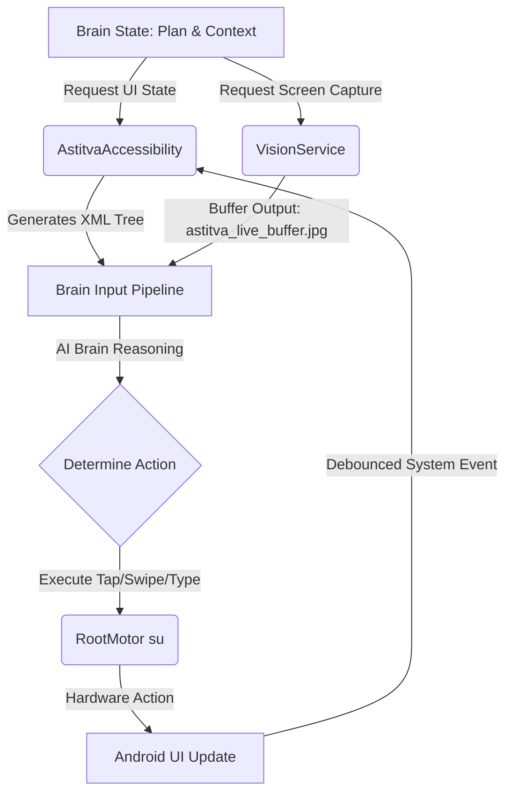

# ASTITVA OS (v6.0.0-GOD-MODE)

**ASTITVA** is a professional-grade, living, self-aware system Copilot and autonomous Agent OS built exclusively for Android devices (tested on rooted Termux environments).

**Developed by Vicky**

---

## 🌌 System Architecture Overview

ASTITVA runs as a continuous perception-action loop deeply integrated with the Android OS via superuser (`su`) privileges, accessibility APIs, and visual projection feeds.

---

## 🛠️ Codebase Subsystems & Modules Explained

### 1. **MainActivity (`MainActivity.kt`)**
- **Location:** [MainActivity.kt](app/src/main/java/com/vicky/astitva/MainActivity.kt)
- **Role:** Main controller, orchestrator, and UI thread host. Binds overlays, handles foreground service status, hooks speech-to-text listeners, initializes local llama inference engines, and manages live logging activity feeds.

### 2. **RootMotor (`RootMotor.kt`)**
- **Location:** [RootMotor.kt](app/src/main/java/com/vicky/astitva/core/RootMotor.kt)
- **Role:** The physical output driver ("Hands"). Spawns a root shell `su` process to execute inputs such as:
  - `tap(x, y)`: Clicks exact screen coordinates.
  - `longTap(x, y, duration)`: Holds coordinate for a specified duration.
  - `typeText(text)`: Formats and inserts text payload into editable text areas.
  - `swipe(x1, y1, x2, y2, duration)`: Standard dragging and scrolling gestures.

### 3. **Accessibility Engine (`AstitvaAccessibility.kt`)**
- **Location:** [AstitvaAccessibility.kt](app/src/main/java/com/vicky/astitva/core/AstitvaAccessibility.kt)
- **Role:** The semantic screen analyzer. Debounces layout events to minimize CPU overhead and recursively dumps the system window structure to a clean custom XML node tree outlining text contents, clickable attributes, and screen boundaries.

### 4. **Overlay HUD (`AstitvaOverlayService.kt`)**
- **Location:** [AstitvaOverlayService.kt](app/src/main/java/com/vicky/astitva/core/AstitvaOverlayService.kt)
- **Role:** Draws system-alert overlay windows containing a holographic animated "Orb" WebView (`orb.html`), speech dialog bubbles, and manages draggable touch listeners to move the floating HUD across any running screen.

### 5. **Vision Service (`VisionService.kt`)**
- **Location:** [VisionService.kt](app/src/main/java/com/vicky/astitva/core/VisionService.kt)
- **Role:** The visual sensor ("Eyes"). Runs a high-performance foreground MediaProjection projection stream. Throttles frame captures to 1000ms intervals and monitors frame changes using a 16x16 downsampled comparison logic to preserve CPU and battery life. Saves output buffers to `astitva_live_buffer.jpg`.

### 6. **Brain Manager (`BrainManager.kt`)**
- **Location:** [BrainManager.kt](app/src/main/java/com/vicky/astitva/core/BrainManager.kt)
- **Role:** Configures AI LLM endpoints. Routes queries securely to cloud APIs (Gemini, Claude, OpenAI, DeepSeek, etc.) and lists offline GGUF local model weights from `/sdcard/AstitvaModels`.

### 7. **Memory Core Database (`MemoryCore.kt`)**
- **Location:** [MemoryCore.kt](app/src/main/java/com/vicky/astitva/core/MemoryCore.kt)
- **Role:** Long-term database memory. Built on SQLite FTS5 (Full-Text Search) to index facts, commands, and session message chains. Seamlessly falls back to SQL `LIKE` wildcard search patterns if FTS virtual compilation encounters engine errors.

### 8. **Security Utils (`SecurityUtils.kt`)**
- **Location:** [SecurityUtils.kt](app/src/main/java/com/vicky/astitva/utils/SecurityUtils.kt)
- **Role:** Protects keys. Uses Android KeyStore API to generate a hardware-backed 256-bit AES cryptographic key. Encrypts user API credentials with random 12-byte initialization vectors (AES/GCM/NoPadding) before saving them to system shared preferences.

### 9. **Agent Broker (`AgentBroker.kt`)**
- **Location:** [AgentBroker.kt](app/src/main/java/com/vicky/astitva/utils/AgentBroker.kt)
- **Role:** Decoupled event broker. Implements a thread-safe publish-subscribe handler pattern to dispatch alerts and logs between background services and foreground controllers.

### 10. **Agentic Tools (`AgenticTools.kt`)**
- **Location:** [AgenticTools.kt](app/src/main/java/com/vicky/astitva/core/AgenticTools.kt)
- **Role:** Feature library. Provides standard programmatic functions for reading inbox SMS messages, fetching current coordinates (GPS), notification listing, terminal command runs, and network health monitoring.

---

## 📸 Media & Screenshots (UI Demo)

### 🎥 Demonstration Recording
The latest UI walk-through and screen recording is committed inside the repository directory:  
[🎥 astitva_ui_recording.mp4](media/video/astitva_ui_recording.mp4)

### 🖼️ UI Screenshots
The 10 most recent snapshots displaying Astitva's interface are committed inside:  
[🖼️ media/screenshots/](media/screenshots/)

---
**Developed by Vicky**
