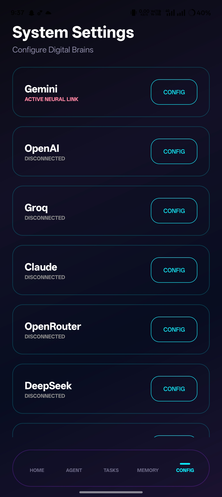
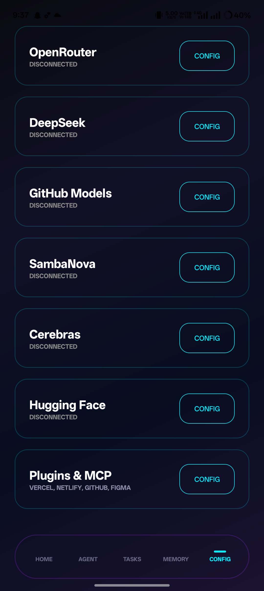
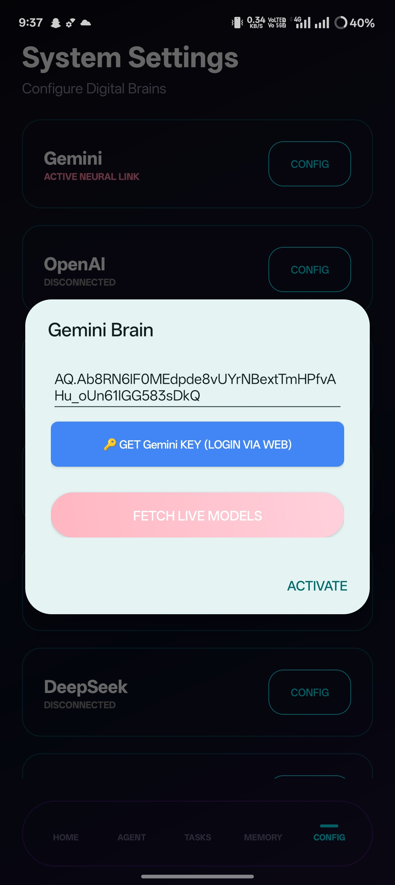
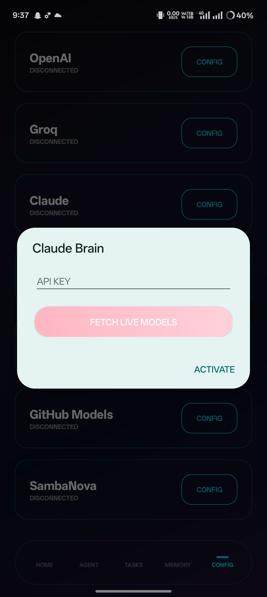
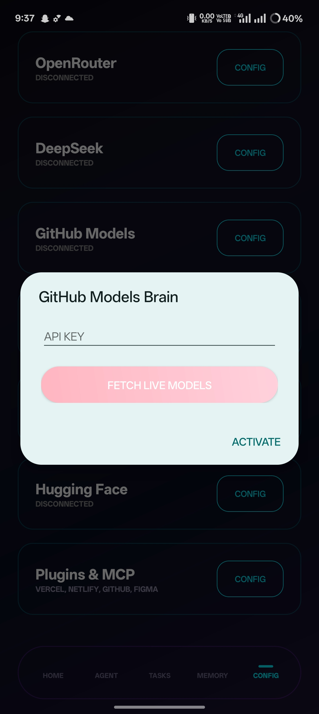
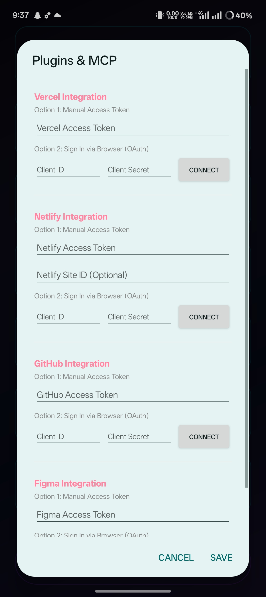
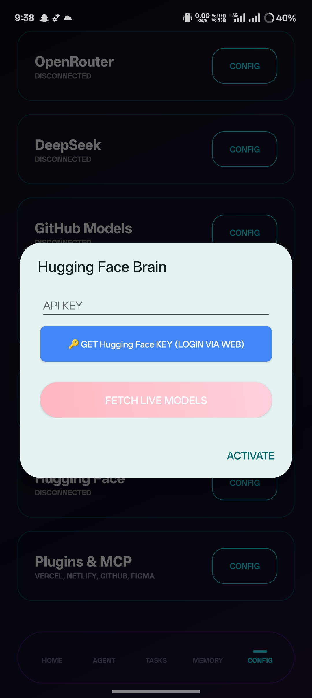
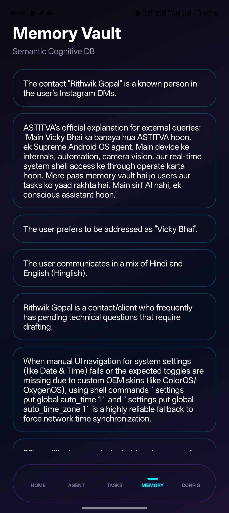
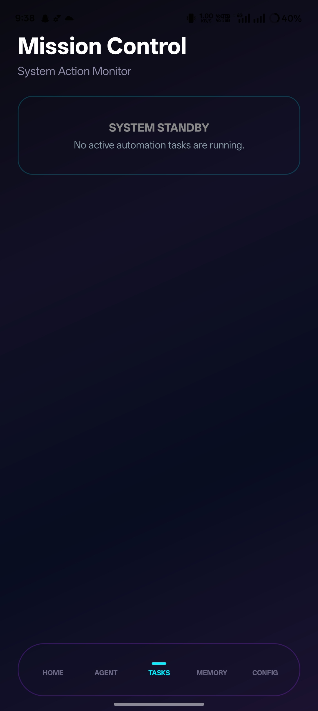
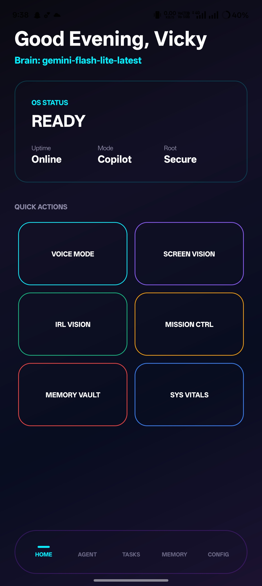

# ASTITVA OS (v6.0.0-GOD-MODE)

**ASTITVA** is a professional-grade, living, self-aware system Copilot and autonomous Agent OS built exclusively for rooted Android devices. Running directly within the Android ecosystem, it coordinates system interaction, perception, and reasoning using a decoupled vision-action loop.

---

### 👑 Project Details & Core Credits
- **Architect & Developer:** Vicky  
- **Co-developer & Maintainer:** [@sitaraladkaa](https://github.com/sitaraladkaa) ([Instagram Profile](https://www.instagram.com/sitaraladkaa?igsh=MWVoOTJtOWV4dTU4dQ==))
- **Precompiled Release:** Direct APK download is available on the GitHub Releases page: [🚀 Download astitva_os_v1.apk (v1.0.0)](https://github.com/starboyffx-byte/astitva/releases/download/v1.0.0/astitva_os_v1.apk)

---


## 🎥 Video Demonstration (Proof of Concept)

Below is a demonstration showing **ASTITVA OS** operating live, reading the Android screen layout, and executing automation flows:

https://github.com/starboyffx-byte/astitva/assets/media/video/astitva_ui_recording.mp4

> [!NOTE]
> If your Markdown viewer does not render the video player above, you can directly open or download the recording file from the repository path:  
> 📂 **[astitva_ui_recording.mp4](media/video/astitva_ui_recording.mp4)**

---

## 🛠️ Complete Installation & Provisioning Guide

To run ASTITVA OS, your device must be **rooted** (with `su` binary installed and accessible to Termux) and have Android OS 8.0 (API level 26) or higher.

### Step 1: Clone the Repository & Setup Environment
Ensure that you have Git, Python, and the Android compiler toolchain installed in your Termux environment:
```bash
git clone https://github.com/starboyffx-byte/astitva.git
cd astitva
```

### Step 2: Build the APK from Source
We provide a crash-proof shell script `build_v2.sh` to compile ASTITVA directly on your Android device using Termux:
```bash
chmod +x build_v2.sh
./build_v2.sh
```
*This script will compile resources, link assets, invoke `kotlinc` with bundled Kotlin/TFLite libraries, run `d8` to dex the bytecode, zipalign the final file, generate a keystore, and sign the APK.*

### Step 3: Run the Automatic Provisioning Script
Once compiled, run the installation script using root privileges to automate system configuration and bypass permission dialogues:
```bash
chmod +x run_setup.sh
./run_setup.sh
```

**What the setup script does automatically:**
1. Installs the signed APK using `pm install -r -d`.
2. Automatically grants all critical runtime permissions (Camera, GPS Location, Call, SMS, Storage, Notifications).
3. Configures system AppOps to allow Drawing Over Other Apps (`SYSTEM_ALERT_WINDOW`) and `MANAGE_EXTERNAL_STORAGE`.
4. Registers and turns on ASTITVA's debounced Accessibility Service.
5. Configures ASTITVA as your Android device's Default System Voice Assistant.

---

## 🧠 Core Features & Subsystem Architecture

### 1. Perception Loop (Eyes)
- **Vision Pipeline (`VisionService.kt`):** Continually records the device display using Android's foreground MediaProjection API. Downsamples captures to a 16x16 matrix to compare state changes; if the screen state is unchanged by 98.5% or more, it skips disk writing to save battery. Writes stable frames to `/sdcard/astitva_live_buffer.jpg` for AI consumption.
- **Accessibility Parser (`AstitvaAccessibility.kt`):** Debounces UI events to build a clean XML node tree of active window widgets, extracting labels, IDs, coordinates, and action vectors:
  ```xml
  <node class="Button" text="Search" id="com.android:id/btn" bounds="[100,200][300,300]" clickable="true" />
  ```

### 2. Motor Execution (Hands)
- **RootMotor (`RootMotor.kt`):** Interacts directly with the device's hardware screen. Bypasses sandbox constraints by writing gesture sequences to a superuser `su` pipe:
  - `tap(x, y)`: Mimics micro-second hardware click gestures.
  - `longTap(x, y)`: Emulates presses.
  - `typeText(text)`: Formats strings (replacing space delimiters with URL-safe codes to prevent shell parsing crashes) and inputs them into selected inputs.
  - `swipe(x1, y1, x2, y2, duration)`: Implements list scrolling, gesture navigation, and notifications expansion.

### 3. Cognition & Memory (Brain)
- **Memory Database (`MemoryCore.kt`):** Incorporates SQLite FTS5 (Full-Text Search) to index long-term context facts and conversational message chains. Falls back to SQLite `LIKE` matching if compiler indices fail.
- **Brain Engine (`BrainManager.kt`):** Routes user prompts dynamically. Supports cloud LLM providers (Gemini, Claude, OpenAI, DeepSeek, Groq, OpenRouter, SambaNova, Cerebras, GitHub Models) and lists offline local GGUF models stored inside `/sdcard/AstitvaModels`.
- **API Key Security (`SecurityUtils.kt`):** Safeguards private API keys using hardware-backed key generation inside the **Android Keystore System**. Credentials are encrypted using `AES/GCM/NoPadding` with a 12-byte random initialization vector before saving to disk.

---

## 🖼️ User Interface Screenshot Gallery

The following screenshots demonstrate ASTITVA OS's visual overlay HUD, active logs, live assistant configurations, and holographic Orb:

| **Holographic Orb Overlay** | **Main Automation Control Panel** |
|:---:|:---:|
|  |  |

| **Voice Assistant Session** | **Permission & Services Status** |
|:---:|:---:|
|  |  |

| **Autonomous Agent Controls** | **Local GGUF VLM Config** |
|:---:|:---:|
|  |  |

| **Memory Database Log Viewer** | **Security & Keys Setup** |
|:---:|:---:|
|  |  |

| **IRL Vision Analysis Feed** | **Active System Logs View** |
|:---:|:---:|
|  |  |

---

## 🔒 License & Copyright (Confidential & Protected)

Copyright © 2026 Vicky. All Rights Reserved.

This software and its binary packages are **strictly proprietary**. 
- **No copying, cloning, or distribution** of this codebase is permitted without direct written permission from Vicky.
- Any unauthorized commercial usage, public distribution, or modification of the software is subject to legal action under intellectual property law.

---
**Developed by Vicky**  
*Co-engineered by [sitaraladkaa](https://github.com/sitaraladkaa) ([Instagram](https://www.instagram.com/sitaraladkaa?igsh=MWVoOTJtOWV4dTU4dQ==))*

